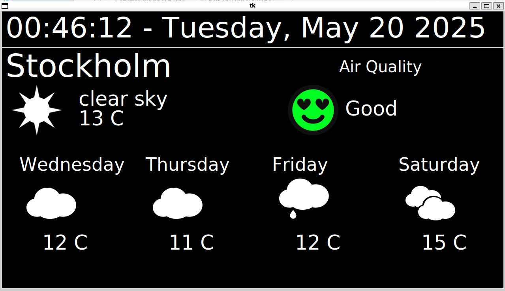

**A simple weather and air quality station.**

It has been designed to run on a 7" screen with a Raspberry Pi 3B+

Data are retrieved from [OpenWeatherMap](https://openweathermap.org/) and [Aqicn](https://aqicn.org/)



# Requirements

  * Python 10+
  * OpenWeatherMap Key. Free, need to sign up and add a free key to your account at [OpenWeatherMap sign up](https://home.openweathermap.org/users/sign_up)
  * Aqicn Key. Free, need to sign up at [Aqicn token](https://aqicn.org/data-platform/token/)

# Configuration

## Cities
Cities names should be compatible with both OpenWeatherMap and Aqicu definition. This is usually the case for big cities.

Edit config.py to configure the list of cities to be displayed:

`towns_list = [(town id , number of seconds the town weather is shown befor switching to the next one)]`

```
towns_list = [('Paris' , 10), ('Stockholm' , 10)]
towns_list = [('Paris' , 60), ('Stockholm' , 10), ('New York' , 10)]
towns_list = [('Paris' , 60)]`
```

## Update forecast
Edit config.py to configure the delay between forecast updates (in hour):

`update_delay = 0.5`

## Slow OS
If your Raspberry Pi takes some time to connect to the wifi, then add some sleep time before the soft is launched (in seconds).
Edit config.py:

`os_ready_wait = 60`

## OpenWeahterMap key
Put your key in openweathermap_key.py

## Aqicn key
Put your key in acqicnorg_key.py

# Credits:

## OpenWeatherMap
https://openweathermap.org/

## Aqicn
https://aqicn.org/

## Icons
https://websygen.github.io/owfont/

